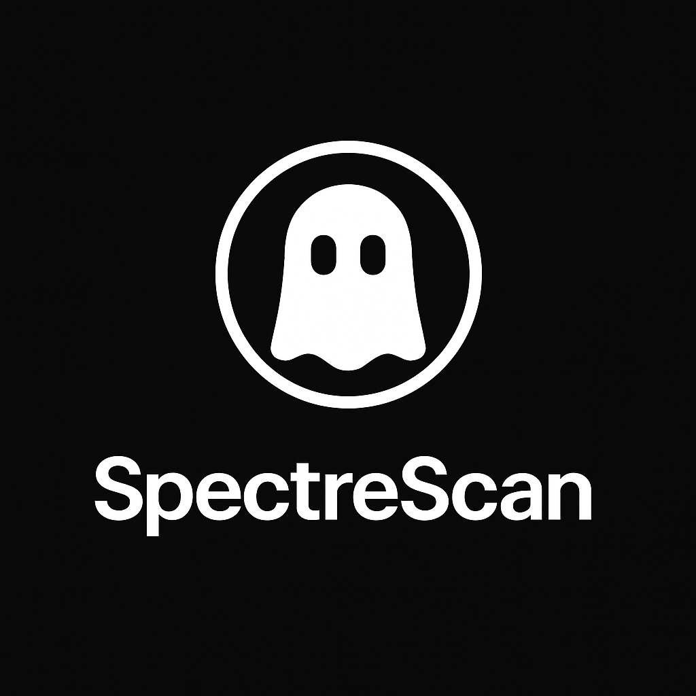

# SpectreScan

SpectreScan is a powerful mobile-first application designed to detect hidden cameras using infrared (IR) light reflections and advanced image processing techniques.



## 🔍 Features

* 📷 **IR Reflection Detection:** Identify hidden lenses by detecting IR light bounces.
* 💡 **Smart Lens Reflection Analysis:** Advanced glint detection filters out false positives.
* 🔬 **LIDAR Anomaly Scanning:** (Pro models) Use LIDAR to detect protrusions on flat surfaces.
* 📲 **Mobile Friendly:** Optimized for both Android and iOS devices.
* ✨ **Dark Mode UI:** For discreet usage in low-light environments.

## 🚀 Installation

```bash
git clone https://github.com/makalin/SpectreScan.git
cd SpectreScan
```

Install dependencies:

```bash
npm install
# or
yarn install
```

For iOS, install pods:
```bash
cd ios && pod install
```

## 📊 Tech Stack

* **Frontend:** React Native
* **Camera:** react-native-vision-camera
* **Navigation:** @react-navigation/native
* **Image Processing:** Custom native modules
* **Machine Learning:** TensorFlow Lite (for glint classification)
* **Optional:** ARKit / LIDAR SDK (iOS Pro models)

## 🏗️ Project Structure

```
SpectreScan/
├── src/
│   ├── components/
│   │   └── CameraView.tsx      # Main camera interface
│   ├── services/
│   │   └── IRDetectionService.ts  # IR detection logic
│   ├── utils/
│   │   └── imageProcessing.ts  # Image processing utilities
│   ├── config.ts              # App configuration
│   └── App.tsx               # Main application component
├── assets/                   # Logos, Icons
├── README.md
└── package.json
```

## 🔧 Configuration

The application can be configured through `src/config.ts`:

* Camera settings (FPS, resolution)
* IR detection parameters
* LIDAR settings (for Pro models)
* UI customization
* App metadata

## 📝 Usage

1. Launch the app
2. Grant camera permissions when prompted
3. Dim the lights for optimal detection
4. Press 'Start Scan' and slowly sweep your camera across the room
5. Detected reflections will be highlighted with red markers

## 🛠️ Development

### Prerequisites

* Node.js >= 14
* React Native development environment
* iOS: Xcode 12+
* Android: Android Studio 4+

### Building

```bash
# iOS
npm run ios

# Android
npm run android
```

### Testing

```bash
npm test
```

## 🔒 Permissions

The app requires the following permissions:

* Camera access
* Storage access (for saving scan results)
* LIDAR access (Pro models only)

## 🙌 Contributing

We welcome contributions!

1. Fork the repo
2. Create your feature branch (`git checkout -b feature/new-feature`)
3. Commit your changes (`git commit -am 'Add new feature'`)
4. Push to the branch (`git push origin feature/new-feature`)
5. Open a Pull Request

## 💪 License

MIT License. See [LICENSE](./LICENSE) for more information.

---

**SpectreScan** - Reveal the unseen. 🔮
