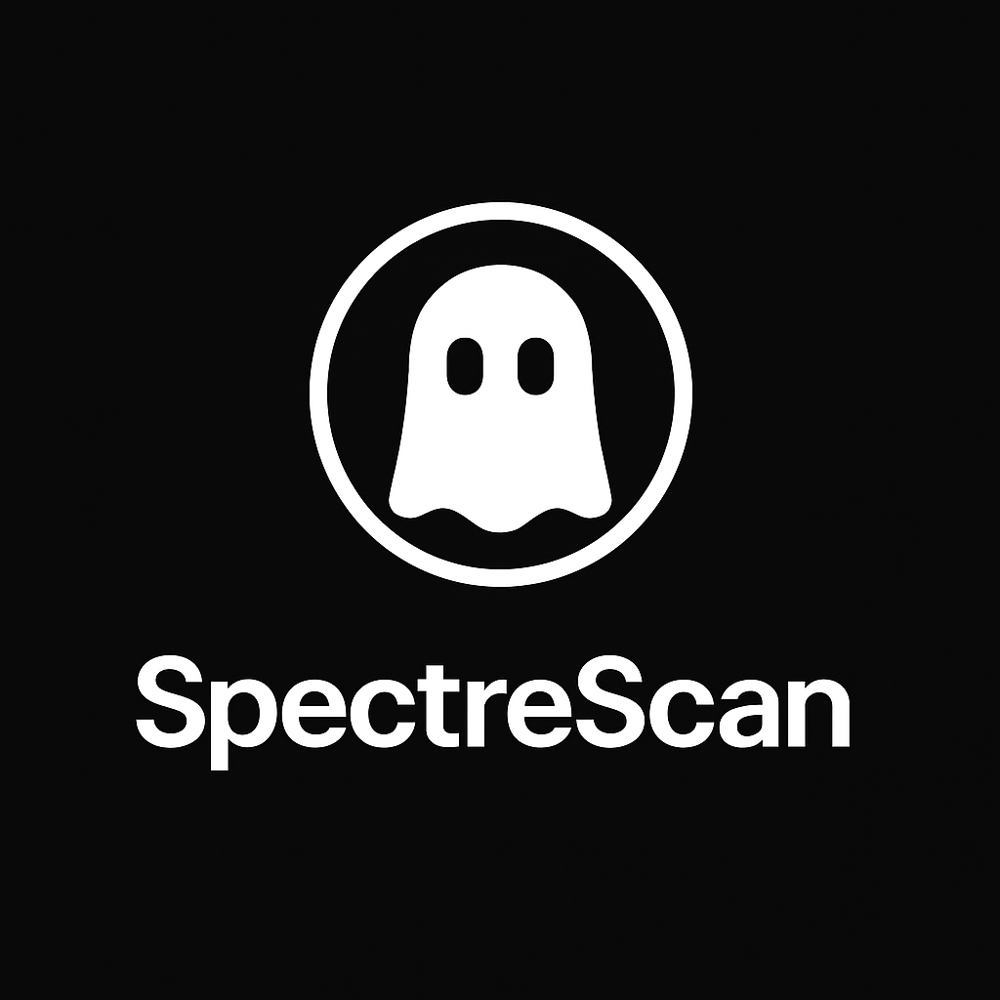

# SpectreScan

SpectreScan, kızılötesi (IR) ışık yansımaları ve gelişmiş görüntü işleme teknikleri kullanarak gizli kameraları tespit etmek için tasarlanmış güçlü bir mobil uygulamadır.



## 🔍 Özellikler

* 📷 **IR Yansıma Tespiti:** Gizli lensleri IR ışık yansımalarını tespit ederek belirler.
* 💡 **Akıllı Lens Yansıma Analizi:** Gelişmiş parıltı tespiti yanlış pozitifleri filtreler.
* 🔬 **LIDAR Anomali Taraması:** (Pro modeller) Düz yüzeylerdeki çıkıntıları tespit etmek için LIDAR kullanır.
* 📲 **Mobil Uyumlu:** Android ve iOS cihazlar için optimize edilmiştir.
* ✨ **Karanlık Mod Arayüzü:** Düşük ışıklı ortamlarda gizli kullanım için.

## 🚀 Kurulum

```bash
git clone https://github.com/makalin/SpectreScan.git
cd SpectreScan
```

Bağımlılıkları yükleyin:

```bash
npm install
# veya
yarn install
```

iOS için, pod'ları yükleyin:
```bash
cd ios && pod install
```

## 📊 Teknoloji Altyapısı

* **Ön Yüz:** React Native
* **Kamera:** react-native-vision-camera
* **Navigasyon:** @react-navigation/native
* **Görüntü İşleme:** Özel native modüller
* **Makine Öğrenimi:** TensorFlow Lite (parıltı sınıflandırması için)
* **Opsiyonel:** ARKit / LIDAR SDK (iOS Pro modelleri)

## 🏗️ Proje Yapısı

```
SpectreScan/
├── src/
│   ├── components/
│   │   └── CameraView.tsx      # Ana kamera arayüzü
│   ├── services/
│   │   └── IRDetectionService.ts  # IR tespit mantığı
│   ├── utils/
│   │   └── imageProcessing.ts  # Görüntü işleme yardımcıları
│   ├── config.ts              # Uygulama yapılandırması
│   └── App.tsx               # Ana uygulama bileşeni
├── assets/                   # Logolar, İkonlar
├── README.md
└── package.json
```

## 🔧 Yapılandırma

Uygulama `src/config.ts` üzerinden yapılandırılabilir:

* Kamera ayarları (FPS, çözünürlük)
* IR tespit parametreleri
* LIDAR ayarları (Pro modeller için)
* Arayüz özelleştirmesi
* Uygulama meta verileri

## 📝 Kullanım

1. Uygulamayı başlatın
2. İstenildiğinde kamera izinlerini verin
3. Optimum tespit için ışıkları kısın
4. 'Taramayı Başlat' düğmesine basın ve kamerayı odayı tarayacak şekilde yavaşça hareket ettirin
5. Tespit edilen yansımalar kırmızı işaretçilerle vurgulanacaktır

## 🛠️ Geliştirme

### Ön Koşullar

* Node.js >= 14
* React Native geliştirme ortamı
* iOS: Xcode 12+
* Android: Android Studio 4+

### Derleme

```bash
# iOS
npm run ios

# Android
npm run android
```

### Test

```bash
npm test
```

## 🔒 İzinler

Uygulama aşağıdaki izinleri gerektirir:

* Kamera erişimi
* Depolama erişimi (tarama sonuçlarını kaydetmek için)
* LIDAR erişimi (sadece Pro modeller)

## 🙌 Katkıda Bulunma

Katkılarınızı bekliyoruz!

1. Repoyu fork edin
2. Özellik dalınızı oluşturun (`git checkout -b feature/yeni-ozellik`)
3. Değişikliklerinizi commit edin (`git commit -am 'Yeni özellik eklendi'`)
4. Dalınıza push yapın (`git push origin feature/yeni-ozellik`)
5. Pull Request açın

## 💪 Lisans

MIT Lisansı. Daha fazla bilgi için [LICENSE](./LICENSE) dosyasına bakın.

---

**SpectreScan** - Görünmeyeni ortaya çıkarın. 🔮 